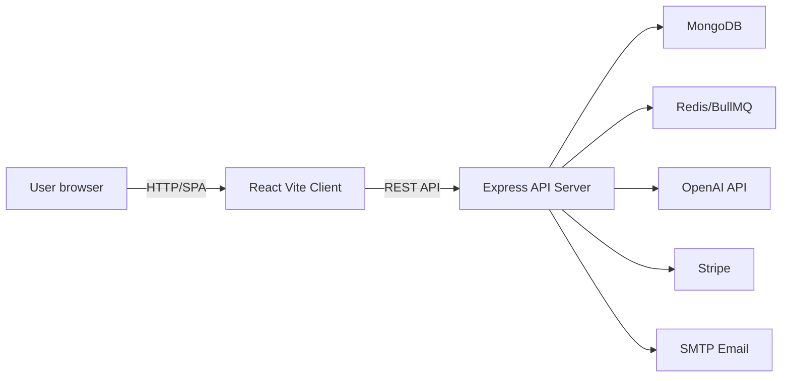

# ReviewSense AI

ReviewSense AI is a modular SaaS platform for local business review intelligence. It transforms customer feedback from multiple sources into actionable insights, AI-generated replies, competitor benchmarking, and polished PDF summaries.

## Architecture

- `apps/client` — React + TypeScript frontend with Vite, TailwindCSS, React Query, and Zustand patterns.
- `apps/server` — Express.js backend using TypeScript, Mongoose, JWT authentication, Redis/BullMQ scaffolding, OpenAI integration, Stripe billing stubs, and email notification helpers.
- `packages/types` — shared TypeScript models and domain contracts.
- `packages/utils` — reusable validation utilities and schema helpers.
- `packages/ui` — shared UI primitives for buttons, cards, and form fields.

### Architecture diagram



## Key Features

- Authentication: register, login, JWT, refresh tokens, Google OAuth-ready config.
- Review ingestion: CSV uploads, raw review ingestion, duplicate-safe data modeling.
- AI sentiment engine: sentiment, topics, praise, pain point extraction, urgency scoring.
- Reply generation: tone-based AI reply drafts with regeneration support.
- Dashboard analytics: total reviews, sentiment distribution, average rating, topic heatmaps.
- Competitor comparison: premium gated competitor analysis and benchmarking.
- SaaS billing: plan updates, usage limits, subscription status endpoints.
- DevOps: Docker, Docker Compose, GitHub Actions, monorepo workspace structure.

## Getting Started

### Prerequisites

- Node.js 20+
- npm
- Docker (optional for local containerized stack)

### Local install

```bash
npm install
npm run dev --workspace=apps/server
npm run dev --workspace=apps/client
```

### Environment

Copy `.env.example` to `.env` and fill in credentials.

### Build

```bash
npm run build
```

### Tests

```bash
npm run test --workspace=apps/server
npm run test --workspace=apps/client
```

## Deployment

- Use `apps/server/Dockerfile` for backend production builds.
- Use `apps/client/Dockerfile` to build and serve the frontend.
- `docker/docker-compose.yml` can run MongoDB + Redis alongside the app.

## Folder structure

```txt
reviewsense-ai/
├── apps/
│   ├── client/
│   └── server/
├── packages/
│   ├── types/
│   ├── ui/
│   └── utils/
├── docker/
└── .github/
```

## Notes

This repository is designed as a startup-ready MVP scaffold. The workflow includes modular backend services, shared package contracts, and product-ready UI storyboarding.
