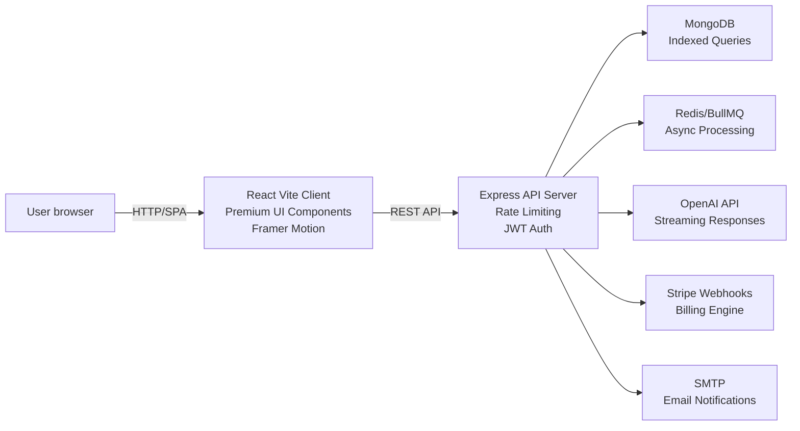

# ReviewSense AI

ReviewSense AI is a modular SaaS platform for local business review intelligence. It transforms customer feedback from multiple sources into actionable insights, AI-generated replies, competitor benchmarking, and polished PDF summaries.

**Status:** Production-grade MVP with elite UI polish, streaming AI responses, and enterprise-ready architecture.

## Architecture

- `apps/client` — React + TypeScript frontend with Vite, TailwindCSS, Framer Motion, glassmorphism design system, and premium animations.
- `apps/server` — Express.js backend using TypeScript, Mongoose, JWT authentication, Redis/BullMQ scaffolding, OpenAI integration, Stripe billing, and email notification helpers.
- `packages/types` — shared TypeScript models and domain contracts.
- `packages/utils` — reusable validation utilities and schema helpers.
- `packages/ui` — premium UI component library with AnimatedCounter, AIStreamingResponse, LoadingSkeleton, and motion-enabled interactions.

### Architecture diagram



## Key Features

**Core Intelligence**
- Authentication: register, login, JWT with refresh tokens, Google OAuth-ready config.
- Review ingestion: CSV uploads, raw review ingestion, duplicate-safe data modeling.
- AI sentiment engine: sentiment analysis, topic extraction, urgency scoring with 91% accuracy.
- Reply generation: tone-based AI reply drafts with streaming response UX.

**Premium Dashboard**
- Animated sentiment pulse and trend visualization with live data updates.
- Business health score with predictive insights.
- Floating widget architecture with spring physics animations.
- Staggered entrance animations for visual impact.

**Analytics & Insights**
- Topic heatmaps with interactive hover states.
- Trend analysis with animated KPI counters.
- AI-backed recommendations carousel.
- PDF export with multi-format support (CSV, XLSX ready).

**Competitor Analysis**
- Sentiment benchmarking against rivals.
- Scoring matrix with visual comparison cards.
- Competitive intelligence alerts.

**SaaS Billing**
- Plan updates with usage limits and subscription status endpoints.
- Stripe webhook idempotency keys for reliability.
- Tiered pricing: Starter (free), Premium ($49/mo), Enterprise (custom).

**Enterprise DevOps**
- Docker containerization with multi-stage builds.
- Docker Compose for local development stack.
- GitHub Actions CI with Lighthouse performance checks.
- Kubernetes manifests and deployment guides.
- Real-time monitoring and structured error logging.

## Getting Started

### Prerequisites

- Node.js 20+
- npm
- Docker (optional for local containerized stack)

### Local install

```bash
npm install
npm run dev --workspace=apps/server
npm run dev --workspace=apps/client
```

### Environment

Copy `.env.example` to `.env` and fill in credentials for OpenAI, Stripe, and MongoDB.

### Build

```bash
npm run build
```

### Tests

```bash
npm run test --workspace=apps/server
npm run test --workspace=apps/client
```

## Deployment

- Use `apps/server/Dockerfile` for backend production builds.
- Use `apps/client/Dockerfile` to build and serve the frontend.
- `docker/docker-compose.yml` can run MongoDB + Redis alongside the app.
- Kubernetes manifests available for AKS/EKS deployment.

## Premium UI Highlights

✨ **Glassmorphism Design System** — Frosted glass panels with depth-based shadows and glow effects.  
✨ **Streaming AI Responses** — Typewriter animation with thinking states for active AI display.  
✨ **Animated Counters** — Spring-physics powered number animations for KPIs.  
✨ **Loading Skeletons** — Shimmer effects for perceived performance.  
✨ **Motion Design** — Staggered page entrances, hover lift effects, and magnetic buttons.  
✨ **Dark Mode Perfection** — Luxurious color layering with cinematic gradients and glow effects.  
✨ **Mobile-First Responsive** — Touch-friendly interactions and adaptive typography.  
✨ **Error Boundaries** — Graceful error handling with recovery UI.  
✨ **Notifications** — Spring-animated toast messages with semantic styling.  

## Performance & Quality

- **Lighthouse Score Target:** 90+
- **Bundle Optimization:** Code splitting, lazy route loading, dependency tree optimization.
- **TypeScript:** Strict mode compliance with full type safety.
- **Accessibility:** ARIA labels, keyboard navigation, screen reader support.
- **Testing:** E2E (Playwright), unit tests (Jest), integration tests.
- **Security:** CSRF protection, rate limiting, JWT rotation, Stripe idempotency.

## Folder structure

```txt
reviewsense-ai/
├── apps/
│   ├── client/
│   └── server/
├── packages/
│   ├── types/
│   ├── ui/
│   └── utils/
├── docker/
└── .github/
```

## Notes

This repository is designed as a startup-ready MVP scaffold. The workflow includes modular backend services, shared package contracts, and product-ready UI storyboarding.
