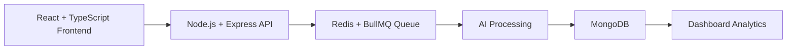

# Revora AI

> **AI-Powered Customer Review Intelligence Platform**

Revora AI helps local businesses convert scattered customer reviews into sentiment insights, actionable recommendations, and faster owner responses.


## Product Problem

Small and mid-sized businesses receive reviews across Google, Yelp, Zomato, and social channels. Most teams struggle with:

- delayed responses to negative reviews
- no clear trend visibility by topic or sentiment
- reactive decision-making without reliable analytics

Revora AI solves this by centralizing review ingestion, running AI sentiment/topic analysis, and surfacing practical actions through a business-focused dashboard.

## Core Features

- Review ingestion: CSV upload and structured review capture for multi-source feedback.
- Sentiment analysis: AI classification for positive, neutral, negative, and urgency trends.
- AI reply generation: draft contextual responses with business-friendly tone controls.
- Dashboard analytics: health score, sentiment trend, complaint categories, and response metrics.
- Competitor benchmarking: compare sentiment and service perception against rivals.
- SaaS usage controls: JWT auth, subscription tiers, and usage-based access boundaries.

## Architecture



Why this architecture is practical:

- Redis is used for fast caching and low-latency transient workload handling.
- BullMQ is used to move heavy AI processing out of request-response cycles.
- MongoDB stores flexible review documents and analytics-friendly metadata.

## Screenshots

Add project screenshots in `docs/screenshots/` and reference them here:

- Landing page: `docs/screenshots/landing.png`
- Dashboard overview: `docs/screenshots/dashboard.png`
- Analytics page: `docs/screenshots/analytics.png`
- AI reply generation: `docs/screenshots/ai-reply.png`
- Mobile layout: `docs/screenshots/mobile.png`

## Technical Highlights

- TypeScript strict mode across frontend and backend
- Queue-based AI processing pipeline using Redis + BullMQ
- JWT authentication with protected application routes
- Responsive UI for desktop and mobile
- Dockerized local setup for server, client, MongoDB, and Redis
- CI-ready build/lint/test scripts

## Local Setup

### 1. Install dependencies

```bash
npm install
```

### 2. Configure environment

```bash
cp .env.example .env
```

Set your keys in `.env` (`OPENAI_API_KEY`, `JWT_SECRET`, `MONGO_URI`, etc.).

### 3. Run development

```bash
npm run dev
```

### 4. Build and test

```bash
npm run build
npm run lint
npm run test
```

## Repository Structure

```txt
apps/
  client/   -> React + TypeScript UI
  server/   -> Express + TypeScript API
packages/
  ui/       -> shared UI components
  types/    -> shared domain types
  utils/    -> reusable utility logic
docker/
  docker-compose for local stack
```

## Interview-Friendly Project Story

Revora AI was built as a realistic SaaS MVP to solve a practical business problem: turning unstructured customer feedback into weekly operational decisions. The project emphasizes clean architecture, async AI workflows, and a polished product experience without overengineering.
